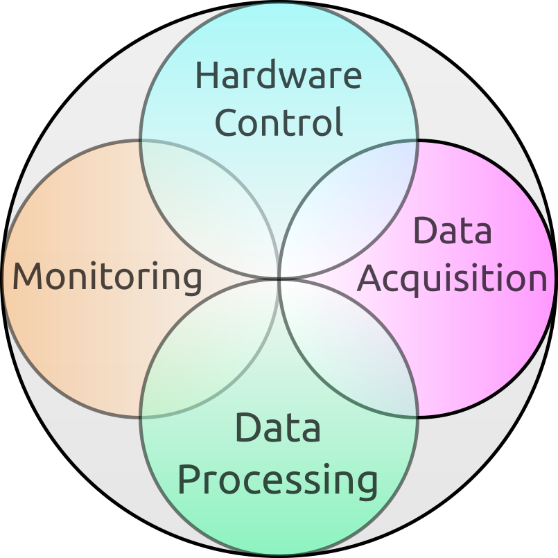
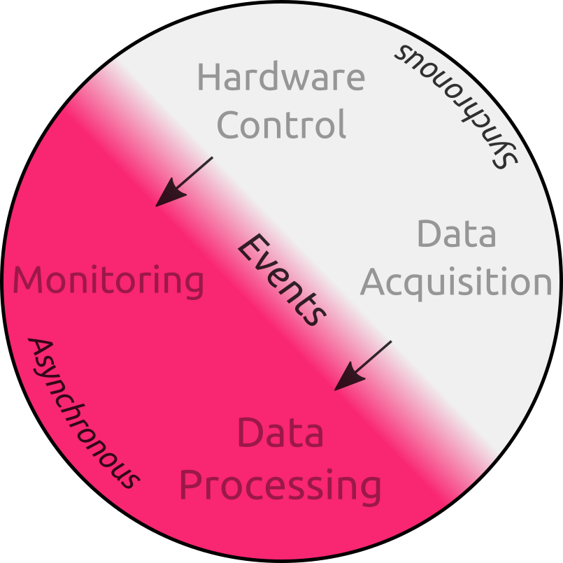
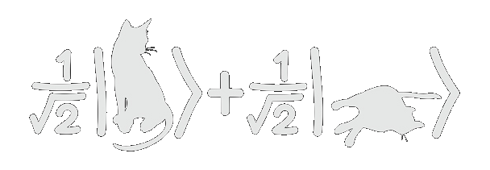
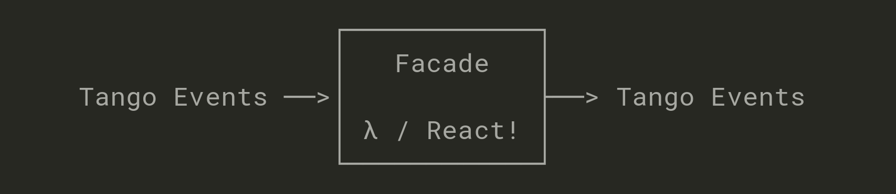

name: empty layout
layout: true

---
name: title
class: center, middle, inverse, title

Reactive programming
====================

## and how it fits within control systems

•

[**Vincent Michel**](https://github.com/vxgmichel) @ ESRF

ICALEPCS 2017 - Barcelona

•

GitHub: [**vxgmichel/icalepcs-reactive-programming**](https://github.com/vxgmichel/icalepcs-reactive-programming)

Slides: [**tinyurl.com/icalepcs-rp**](http://tinyurl.com/icalepcs-rp)

•


.footnote.right[.red[**⚠ Warning :**] contains real code chunks!]

---
class: center, middle, inverse

What is reactive programming ?
==============================

***

It's .red[→] About .red[→] Propagating .red[→] Changes
------------------------------------------------------

### *Hum, this looks like a pipeline...*

---
class: center, inverse

**Imperative** → assignment
-----------------------

### .red[**`C = A + B`**]

### `C` is **NOT** updated if `A` or `B` changes

***

**Reactive** → definition
---------------------

### .red[**`C := A + B`**]

### `C` **IS** updated if `A` or `B` changes

---
class: middle, inverse

Examples
========

## [**Python properties**](https://docs.python.org/3/library/functions.html#property)

```python3
@property
def C(self):
*   return self.A + self.B
```

``` python3
obj.A = 1
obj.B = 2
assert obj.C == 3
# Here comes the change!
obj.B = 10
assert obj.C == 11
```

### Descriptive, but .red[**not asynchronous**]

---
class: middle, inverse

## **[Kivy](kivy.org)/[QML](http://doc.qt.io/qt-5/qmlapplications.html)** (declarative approach)

```kivy
TextInput:
    id: A
    text: '0'
TextInput:
    id: B
    text: '0'
Label:
    id: C
*   text: str(int(A.text) + int(B.text))
```

## The kivy app:

.center[]

---
class: middle, inverse

## **[Rx](http://reactivex.io/)/[RxPy](https://github.com/ReactiveX/RxPY)** (constructive approach)

```python
# A counts every second starting from 0
A = Observable.interval(1000)

# B delays A by 0.5 seconds
B = A.delay(500)

# C sums the latest values from A and B
*C = A.combine_latest(B, lambda a, b: a + b)
```

## Marble diagram

```bash
A stream: ─0───────1───────2───────3──────>
B stream: ─────0───────1───────2───────3──>
C stream: ─────0───1───2───3───4───5───6──>
```
---
class: middle, inverse


How/when is it useful?
======================


### .large.red[⇶　]Event-based channels ≈ reactive data streams

### .large.red[λ　]Less state to manage → more functionnal, less side effect

### .large.red[≝　]A declarative interface hides the implementation logic

---
class: center, middle, inverse

What about control systems?
===========================

.center[]

---
class: center, middle, inverse

Where does reactive programming apply?
======================================

.center[]

---
class: inverse

Monitoring and events
=====================

***

## **Golden rule**

# .red[**Monitoring shoudn't affect the world**]

--

## (unless your experiment includes a cat in a box)

.center[]

---
class: center, inverse, middle

.red[**Implications**]
----------------------

### The monitoring system .red[**should never**] trigger a hardware request

### A system-agnostic service is managing and .red[**protecting**] the hardware

### .red[→] It does not care about the number of interested agents

---
class: center, inverse, middle

.red[**How to get the hardware values then?**]
---------------------

### Reading from a cache is OK

### But it introduces some .red[**latency**]

### .red[**PUB/SUB**] is much nicer!


---
class: center, inverse, middle

.red[**Should we give up on RPC?**]
-----------------------------------


### .red[**REQ/REP**] is perfectly fine for running explicit commands

### Because commands are the result of a .red[**user decision**]

### .red[**However**], the monitoring system .red[**is not**] a user

---
class: center, inverse, middle

.red[**In practice, what can be done reactively?**]
--------------------------------------------------

### Apply conversions, .red[**e.g.**] converting hardware units to SI

### Integrate values, .red[**e.g.**] accumulating current to compute a charge

### Combine values, .red[**e.g.**] creating logical conditions for the alarm system


---
class: inverse, middle, center

Has this been implemented somewhere?
====================================

---
class: inverse, middle, center

.red.large[**Yes!**]



### .red[**3656**] facade devices currently running at .red[**MAX-IV**]

•

## The project is available on GitHub

## [MaxIV-KitsControls/tango-facadedevice](https://github.com/MaxIV-KitsControls/tango-facadedevice)

---
class: inverse, center, middle

## Documented

**[tango-facadedevice.readthedocs.io](http://tango-facadedevice.readthedocs.io)**

Full tutorial, API reference and examples

## Unit-tested

**[travis-ci.org/MaxIV-KitsControls/tango-facadedevice](travis-ci.org/MaxIV-KitsControls/tango-facadedevice)**

100% of code coverage :)

## Released

**[pypi.org/project/facadedevice](https://pypi.org/project/facadedevice)**

v1.0.1

---

name: final
class: center, middle, inverse
layout: false

Thank you!
==========

### Questions ?

___

Presentation written in .red[**Markdown**] and rendered by [**remark**](http://remarkjs.com/)

Sources and examples on [**GitHub**](https://github.com/vxgmichel/icalepcs-reactive-programming)

[**vxgmichel/icalepcs-reactive-programming**](https://github.com/vxgmichel/icalepcs-reactive-programming)
